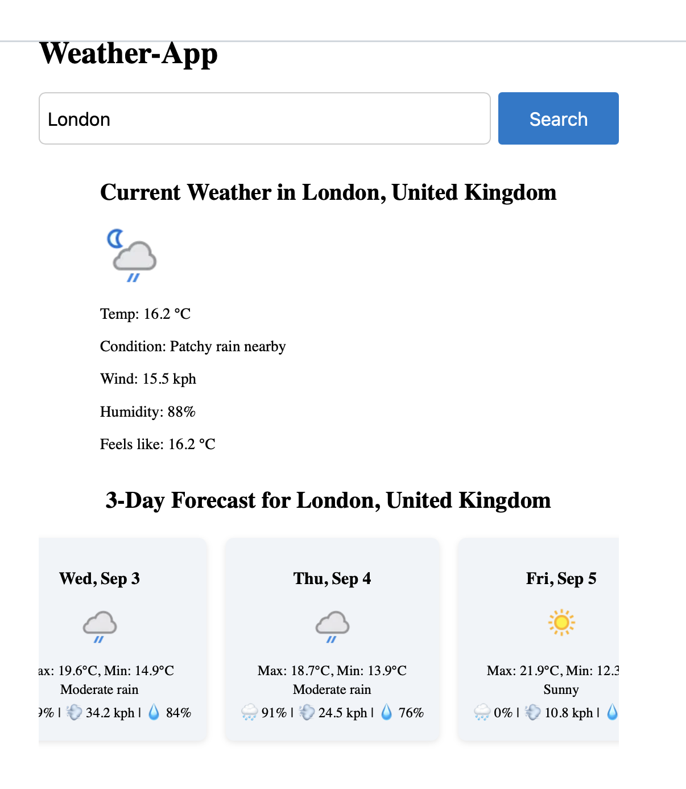

# WeatherApp

This project was generated using [Angular CLI](https://github.com/angular/angular-cli) version 20.2.1.
A modern **weather dashboard application** built with **Angular 20**.  
It allows users to search for a location and view real-time weather conditions and a forecast using child components.  

---

## ✨ Features

- 🔍 Search weather by city/location  
- 🌡️ Display current weather data (`WeatherComponent`)  
- 📅 Show forecast information (`ForecastComponent`)  
- 🎨 Responsive and modern UI with SCSS  
- ⚡ Toast notifications (success/error) using **ngx-toastr**  
- 🔑 API configuration managed via **environment files**

---

## 🛠️ Tech Stack

- [Angular 20](https://angular.dev/) (standalone components)  
- [ngx-toastr](https://www.npmjs.com/package/ngx-toastr) for notifications  
- [Weather API](https://www.weatherapi.com) 
- SCSS for styling  

---

## Screenshot



## Development server

To start a local development server, run:

```bash
ng serve
```

Once the server is running, open your browser and navigate to `http://localhost:4200/`. The application will automatically reload whenever you modify any of the source files.

---

## 🚀 Getting Started

1️⃣ Clone the repository

git clone https://github.com/kocakla/AngularWeatherApp.git
cd weather-dashboard

2️⃣ Install dependencies

npm install

3️⃣ Configure environment

export const environment = {
  production: false,
  apiUrl: 'ApiBaseUrl',
};

4️⃣ Run the app

ng serve

